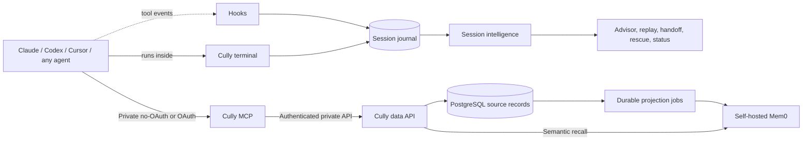

# Architecture

Cully has one Go module with three agent/data entry points and a separate website server. Domain validation is shared across the memory transports; PostgreSQL and HTTP adapters implement the same repository interface.

See [how Cully works](/how-cully-works) for the product-level picture.

## Local session companion

`cully setup --all` owns the complete local startup: Docker memory services, agent integrations in the invoking project, and the advisor daemon. `--mcp-url` uses an existing memory server; `--prepare` only prepares editable configuration. Startup failures return a nonzero exit status.

`cmd/cully` uses the session-control implementation in `internal/cully`. It runs agents in the terminal, renders instruments, runs advisory analysis, manages suggestions and records the session journal.

**The Cully terminal.** `cully run AGENT` starts the agent in a pseudo-terminal that Cully owns. Cully emulates the agent's screen above an expandable panel, so the agent's clear and cursor codes cannot erase the status area. One implementation serves every agent. An agent definition supplies only the executable, its launch arguments and, for Codex, a reader for the native footer. An agent Cully does not know yet is treated as an executable with that name. The panel grows only as far as its content needs and keeps at least 12 agent rows on normal screens and 8 on short ones. Exiting the wrapper stops the agent's process group. It does not create a detached tmux session.

**Tool events and the journal.** An asynchronous `PostToolUse` hook (`cully _internal pane-signal AGENT`) sends one event per tool call. It is inactive outside the terminal. Events become single-letter counters for the panel and one line in a per-session journal: time, agent, kind of tool, pass or fail, a project-relative file path and operation, the program and recognized subcommand of a command, and a one-way hash of the normalized command. Prompts, file contents, command arguments and output are never recorded. See [privacy](/privacy).

**Session intelligence.** Loop detection, verification state, the health bar, the risk label, `cully status`, `timeline`, `replay`, `handoff` and `rescue` are all derived from the journal, with live Git state read at run time and never stored. See [session intelligence](/session-intelligence).

**Per-agent signals.** Codex supplies its native footer, read from the rendered rows in memory. Claude Code supplies context pressure through a hook-fed snapshot, and its visible status line stays silent inside the terminal. Cursor supplies shell, file-edit and MCP events. Codex may run hooks in a persistent app server, so its SessionStart hook binds an opaque session key to the active terminal and ignores `PostToolUse` signals from other sessions. Setup removes only legacy Cully-managed native footer settings and leaves user-owned settings alone. Unknown instruments are shown as unavailable, never borrowed from another agent.

The model-backed advisor has a shared prompt and report pipeline with agent-specific CLI adapters. Signals carry an `agent` field through the job; absent legacy values default to Claude. Claude runs in print mode, Codex runs an ephemeral read-only `exec` process, and Cursor runs in print/ask mode. Unsupported agents fail explicitly rather than silently using another host. The worker runs in the originating project, strips foreground session bindings, and prevents recursive continuity/analysis hooks.

The shared prompt requests bounded owner/project-scoped Cully recall through the selected CLI's configured MCP connection, with semantic recall through Cully when text lookup misses. A concrete capability or current-documentation gap can trigger a separate targeted web-research step. The worker reports recall as checked, unavailable, skipped or unconfirmed; these source markers describe the worker's reported tool use, rather than independent proof of live service access. Claude/Codex restrict Cully to read-only tools. Cursor relies on ask mode and the shared no-edit/no-memory-write instructions. Durable writes remain the foreground agent's responsibility.

Claude retains its richer analysis-hook signals. Codex dispatches bounded context/tool metadata from the wrapper and merges worker findings with its immediate local warnings. Cursor dispatches coarse continuity-stop metadata without opening transcripts. Unknown instruments are not borrowed from another agent. The CLI/model and configured recall/research tools must be available for the worker to use them; local rule warnings do not require successful model analysis.

Durable handoffs and reusable optimization notes use the authenticated Cully MCP memory boundary: PostgreSQL is the source of truth and Mem0 supplies semantic indexing/recall. The foreground agent owns durable writes, and workers use their host CLI's configured connection for read-only recall. The local daemon does not receive an agent OAuth token or call Mem0 directly.

Immediate local rule warnings work offline; model-backed worker analysis and remote recall/research require their configured services. The advisor does not run a background transcript scanner or maintain a second personal/project memory store. Transient local counters, snapshots and diagnostic logs support offline session controls and current warnings. They are live session inputs, not a duplicate durable memory database. Managed session hooks prompt Claude Code and Codex to find relevant prior work; Claude Code and Cursor also have turn-end hooks that ask for concise task summaries through each agent's own Cully MCP connection. Codex relies on its Cully skill for the handoff and has no blocking stop hook. Hooks derive an opaque `session_ref` from the client's session ID when available, so source notes can be grouped by session without storing the raw ID. The `cully_context` MCP tool projects a bounded preview from the same validated, owner-scoped search and recent operations; `cully_get` retrieves full details on demand. The hooks do not upload raw transcripts or give the advisor the agent's OAuth token.

## Public memory boundary

Separate workspace tools coordinate team work. MCP requires OAuth and derives an issuer/subject-scoped principal for workspace operations; existing private-memory subject IDs are unaffected. Workspace requests travel through the same authenticated private API and repository interface. `internal/workspace` owns roles, task transitions, claims, review and publication for all transports.

Migration 006 adds `cully_workspaces` and `cully_workspace_events`. A bounded JSON aggregate holds one team's members, projects, tasks, attempts, drafts and playbooks. PostgreSQL locks the team row, checks current membership and project capabilities, applies a versioned mutation and writes its audit event in the same transaction. Read results are authorized projections; the aggregate is never returned. Conflicts propagate as HTTP 409. This small-team design trades independent project write throughput for a simple transactional authorization boundary; see [deployment limits](/team-deployment#enable-the-team-workspace).

Published lessons use live project lookup, without Mem0 or managed caches. Retrieval checks publication, lesson revision and source-task version. Author edits make a lesson private again; withdrawal/deletion marks dependent playbooks for review. Maintainers adopt only published lessons from completed, current tasks. Guidance changes invalidate pending review packets. Workers never publish records or edit instruction files.

`cully workspace` calls public MCP tools. It accepts a short-lived user OAuth token from `CULLY_WORKSPACE_TOKEN` without persisting it; agents use their configured sign-in. Neither needs database or private data-service credentials. Local `cully task`, `cully handoff` and private memory stay separate from shared tasks and checkpoints.

`cmd/cully-mcp` exposes tools through the official Go MCP SDK and Streamable HTTP. By default it serves one configured owner without OAuth, intended for loopback or a trusted private network. It does not contact an identity provider in that mode. With `--oauth` or `CULLY_MCP_AUTH_MODE=oauth`, `internal/identity` verifies the configured issuer, public resource audience, RS256 signature, expiration and subject. Each tool checks read or write permission.

In OAuth mode, the verified subject becomes the owner. In no-OAuth mode, `CULLY_MCP_OWNER` is the fixed owner. Public tool inputs cannot choose a different owner. OAuth resource metadata is published only in OAuth mode and advertises the configured public resource rather than relying on a proxy-rewritten Host header.

`internal/store/remote` calls the private Go data API with a service token. Database and Mem0 credentials stay with the private data services.

## Private memory service

`cmd/cully-data` hosts the private API, runs the Mem0 worker, and provides explicit `migrate`, `reindex` and `health` commands. `internal/memory` owns types and input validation. `internal/store/postgres` implements owner-scoped SQL using a bounded pgx pool.

PostgreSQL stores authoritative records, owner-scoped indexes and a generated full-text search column. `cully_search` runs text queries there. Cully does not store or query embeddings in its source database; semantic recall is delegated to Mem0 through `cully_recall`.

## Semantic memory

PostgreSQL is authoritative. In the standard stack, source edits and Mem0 projection jobs commit in the same transaction. Self-hosted Mem0 uses its own pgvector-backed database for semantic indexing and candidate recall. A worker reconciles one owner's source entry into Mem0 and retries outages with backoff. Deletes remove the corresponding projection.

`cully_recall` uses Mem0 to find candidates, then loads live records from PostgreSQL. It rejects another owner's records, deleted entries and projections with outdated source timestamps. It returns source records, not unverified raw Mem0 results.

Projection uses `infer=false`: Mem0 embeds authored summaries without adding a fact-extraction model call. Its upstream runtime remains a separate dependency; Cully's own binaries are Go.

## Delivery boundaries

`cmd/cully-web` serves public website assets and a moderated testimonial inbox.
It stores direct submissions and photos in a dedicated persistent website volume,
separate from personal/project memory and its authenticated owner scope. Pending
submissions are private; an operator approves them through the container CLI before
they appear on the homepage. Public LinkedIn metadata imports are best effort and
fall back to manual entry when access is restricted.

For a team deployment, [MCP Auth can connect Cully to an organization's identity provider](team-deployment.md). It authenticates the agent at the MCP boundary; service credentials protect the private data path.
