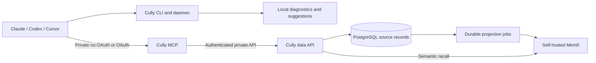

# Architecture

Cully has one Go module with three agent/data entry points and a separate website server. Domain validation is shared across the memory transports; PostgreSQL and HTTP adapters implement the same repository interface.

## Local session companion

`cully setup` owns the complete local startup: Docker memory services, agent integrations in the invoking project, and the advisor daemon. `--mcp-url` uses an existing memory server; `--prepare` only prepares editable configuration. Startup failures return a nonzero exit status.

`cmd/cully` uses the imported session-control implementation in `internal/cully`. It renders instruments, discovers capabilities, runs advisory analysis, manages suggestions and records diagnostic session counters. Claude has the rich command-backed status line and hooks. Codex has one Cully display, the optional `cully codex` terminal wrapper: Cully owns the outer terminal, emulates Codex in the upper half and renders bounded tool-counter advice below. Setup removes only legacy Cully-managed native footer settings and leaves user-owned settings alone. It never stores Codex prompts or tool output. Cursor uses its native integration.

The local advisor works offline. It does not run a background transcript scanner or maintain a second personal/project memory store. Local snapshots and diagnostic logs support session controls. Managed session hooks prompt Claude Code and Codex to find relevant prior work; Claude Code and Cursor also have turn-end hooks that ask for concise task summaries through each agent's own Cully MCP connection. Codex relies on its Cully skill for the handoff and has no blocking stop hook. Hooks derive an opaque `session_ref` from the client's session ID when available, so source notes can be grouped by session without storing the raw ID. The `cully_context` MCP tool projects a bounded preview from the same validated, owner-scoped search and recent operations; `cully_get` retrieves full details on demand. The hooks do not upload raw transcripts or give the advisor the agent's OAuth token.

## Public memory boundary

`cmd/cully-mcp` exposes tools through the official Go MCP SDK and Streamable HTTP. By default it serves one configured owner without OAuth, intended for loopback or a trusted private network. It does not contact an identity provider in that mode. With `--oauth` or `CULLY_MCP_AUTH_MODE=oauth`, `internal/identity` verifies the configured issuer, public resource audience, RS256 signature, expiration and subject. Each tool checks read or write permission.

In OAuth mode, the verified subject becomes the owner. In no-OAuth mode, `CULLY_MCP_OWNER` is the fixed owner. Public tool inputs cannot choose a different owner. OAuth resource metadata is published only in OAuth mode and advertises the configured public resource rather than relying on a proxy-rewritten Host header.

`internal/store/remote` calls the private Go data API with a service token. Database and Mem0 credentials stay with the private data services.

## Private memory service

`cmd/cully-data` hosts the private API, runs the Mem0 worker, and provides explicit `migrate`, `reindex` and `health` commands. `internal/memory` owns types and input validation. `internal/store/postgres` implements owner-scoped SQL using a bounded pgx pool.

PostgreSQL stores authoritative records, owner-scoped indexes and a generated full-text search column. `cully_search` runs text queries there. Cully does not store or query embeddings in its source database; semantic recall is delegated to Mem0 through `cully_recall`.

## Semantic memory

PostgreSQL is authoritative. In the standard stack, source edits and Mem0 projection jobs commit in the same transaction. Self-hosted Mem0 uses its own pgvector-backed database for semantic indexing and candidate recall. A worker reconciles one owner's source entry into Mem0 and retries outages with backoff. Deletes remove the corresponding projection.

`cully_recall` uses Mem0 to find candidates, then loads live records from PostgreSQL. It rejects another owner's records, deleted entries and projections with outdated source timestamps. It returns source records, not unverified raw Mem0 results.

Projection uses `infer=false`: Mem0 embeds authored summaries without adding a fact-extraction model call. Its upstream runtime remains a separate dependency; Cully's own binaries are Go.

## Delivery boundaries

`cmd/cully-web` serves public website assets and a moderated testimonial inbox.
It stores direct submissions and photos in a dedicated persistent website volume,
separate from personal/project memory and its authenticated owner scope. Pending
submissions are private; an operator approves them through the container CLI before
they appear on the homepage. Public LinkedIn metadata imports are best effort and
fall back to manual entry when access is restricted.

For a team deployment, [MCP Auth can connect Cully to an organization's identity provider](team-deployment.md). It authenticates the agent at the MCP boundary; service credentials protect the private data path.
