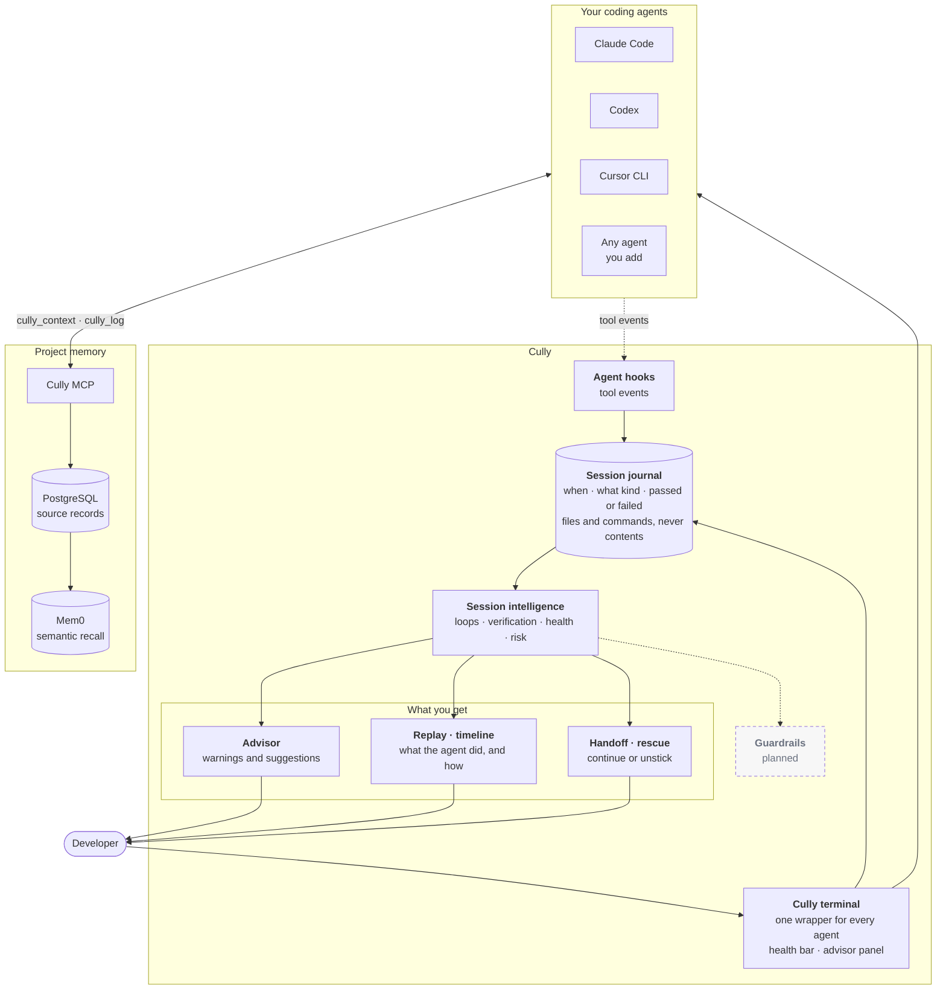

# How Cully works

Cully sits around the coding agents you already use. It does not replace them. It watches the work, understands the session, remembers what matters and helps you steer.

> **Your agent's copilot. Your team's workspace.**
> Solo helps you steer your agent work environment. Team connects people and agents through durable project work.

Choose [Solo mode](/solo) for session health, advice, replay and private memory, or [Team mode](/team-workflows) for shared tasks, ownership, handoffs, review evidence and published lessons. Both use the same installed CLI and services. Project access is explicit; local journals and solo notes never become shared automatically. The session diagram below describes the Solo foundation; [architecture](/architecture#public-memory-boundary) explains Team's separate authorized records.

```text
Prepare  →  Work  →  Hand off  →  Review  →  Reuse
```

| Step | What happens | What does it today |
| --- | --- | --- |
| Observe | Tool activity from the agent becomes events | The [Cully terminal](/terminal) and agent hooks |
| Understand | Events become a picture of the session | The [session journal](/session-intelligence) |
| Remember | Decisions and results outlive the session | [Project memory](/memory) |
| Advise | Warnings and next steps appear while you work | The [advisor](/advisor) |
| Improve | Past sessions teach the next one | Workflow hints today; more on the [roadmap](/product-direction) |

## The picture



Solid boxes ship today. The dashed box is planned and described in [product direction](/product-direction).

Two arrows matter most:

- **Traffic never goes through Cully.** Your agent talks to its model and tools directly. The Cully terminal only draws around the agent, and hooks send small events to the journal.
- **Memory is separate from the session.** The agent saves and finds notes through its own MCP connection. Cully's local parts do not hold your agent's sign-in.

## One terminal for every agent

```sh
cully run claude        # Claude Code
cully run codex         # Codex
cully run cursor        # Cursor CLI (cursor-agent)
cully run my-agent      # any other agent on your PATH
```

Every agent runs in the same wrapper with the same health bar and advisor panel. See [the Cully terminal](/terminal).

## What stays private

The journal keeps coarse facts: time, agent, kind of tool, pass or fail, project-relative file paths with the operation, and the program and recognized subcommand of a command. It never keeps prompts, file contents, command arguments or tool output. See [privacy](/privacy).

## Read next

| If you want to | Read |
| --- | --- |
| See the terminal and health bar | [The Cully terminal](/terminal) |
| Understand loops, replay, handoff and rescue | [Session intelligence](/session-intelligence) |
| Know exactly what is built and what is planned | [Current capabilities](/capabilities) |
| See where Cully is heading | [Product direction](/product-direction) |
