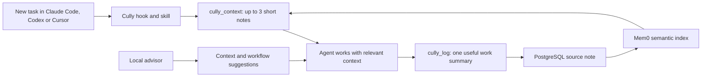

# Keep sessions focused

Cully helps you ship faster with a clear trail of what happened. An agent can retrieve a short note about what it did, how it did it, what passed, what was missed and what comes next without rereading an entire old conversation. PostgreSQL keeps source notes, Mem0 finds related notes by meaning, and Cully returns a few bounded previews. The local advisor watches available session signals and suggests focused next moves.

## What happens during a task

1. **Start with a small lookup.** The installed session hook asks the agent to call `cully_context` for the current project and task. It returns three notes by default, at most five. Each summary is limited to 180 characters and each detail field to 120 characters. A preview includes the record ID, date, agent and an opaque session reference when one was saved; call `cully_get` for one full record when it matters.
2. **Work in the agent's own context.** The agent uses the notes alongside the files and tools it needs for this task. A focused text query reads PostgreSQL; `mode: semantic` uses Mem0 when the wording has changed. Search again when the task or project changes, rather than repeatedly loading the same history.
3. **Leave a useful handoff.** After substantive work, the skill asks the agent to save a concise `cully_log` record: task, approach, result, checks, blocker or missed step, and next step. Claude Code and Cursor can also prompt at turn end; Codex uses the skill without a blocking stop hook. Hooks supply an opaque `session_ref` derived from the client's session ID when available, so notes from one session can be grouped without saving the native ID. The agent uses its own MCP connection and owner identity. PostgreSQL stores the source note; Mem0 indexes it for later recall.

Hooks do not send transcripts to Cully. The agent decides which facts are worth saving, and the Claude Code stop hook skips short, routine replies. A successful MCP call is required before Cully can claim that a shared note was saved.

## What Cully optimizes

| Need | What Cully does |
| --- | --- |
| Context at task start | `cully_context` returns three short previews by default; `cully_get` opens a full record only when needed. |
| Continuity across agents | Structured notes carry project, task, approach, outcome, gaps and next step. The agent and opaque session reference identify their origin when a hook supplied one. |
| Different wording | Mem0 semantic recall can find a related decision or lesson when text search misses it. |
| Long active session | The advisor shows available context pressure and suggests the agent's native inspection or compaction control when useful. |
| Repeated broad exploration | Advisor suggestions can point to focused searches or isolated subagent work instead of rereading the same material. |
| Tool failures and gaps | The advisor can flag repeated faults or a missing integration and suggest a different way to proceed. |
| Test and review loops | The advisor can suggest a verifier, review control or better test workflow. The handoff records what actually passed and what remains unchecked. |
| Model and budget pressure | With Claude Code's richer signals, the advisor can suggest a smaller model or a focused subagent when the task allows it. |

These can reduce repeated work and material in the model's input. They are not a guaranteed reduction in billed tokens or elapsed time. MCP calls, hook continuations and the advisor's own model calls have a cost too. Cully currently does not report a measured before-and-after saving for a session. The richer live context, model and tool signals above are available in Claude Code; Codex and Cursor expose fewer signals to the local advisor today.

## Move from task to checked result

Cully helps the agent spend less time reconstructing old work and more time making and checking the current change. The advisor can flag repeated tool failures, broad searches, a missing verifier or a manual test loop and suggest a more focused control when it has the relevant signals.

For a coding task, a useful loop is:

1. Retrieve the few project notes that affect the change. Open a full record only if the preview is insufficient.
2. Make the smallest change that addresses the task, then run the relevant test or check. Use the agent's own review, test, browser or subagent tools when they fit the work.
3. If checks keep failing, use the advisor's concrete suggestion or inspect `cully suggestions` before repeating the same command. Verify the final behavior and record the result and any remaining gap in the handoff note.

Cully suggests checks; it does not run or certify them automatically. The saved note should distinguish a passing check from a check that was skipped or could not run. That gives the next agent a useful starting point without implying the work was verified when it was not.

Durable handoffs and reusable optimization lessons go through the agent's authenticated Cully MCP connection into PostgreSQL, with Mem0 indexing/recall. Transient local counters and snapshots remain the inputs for offline live warnings. Remote memory supplies prior lessons; it does not replace current session signals or give the daemon the agent's OAuth credentials.

## Use the agent's native controls

Cully uses the extension surfaces each agent actually provides:

| Agent | Cully integration | Useful native control |
| --- | --- | --- |
| Claude Code | `SessionStart` and `Stop` hooks, a live status line, and local advisor analysis of session signals. | `/context` shows where space went; `/compact` reduces an overgrown active conversation. Focused subagents can keep broad research out of the main context. [Claude Code features](https://code.claude.com/docs/en/features-overview), [hooks](https://code.claude.com/docs/en/hooks). |
| Codex | A `SessionStart` hook, a short managed `AGENTS.md` section, the Cully skill and one optional Cully display: the expandable `cully run codex` status panel, combining native footer instruments with bounded `PostToolUse` counters and advice. Cully does not install a blocking `Stop` hook. | Codex can compact a conversation; its `SessionStart` hook also runs after compaction, so the continuity instruction returns. Review newly installed hooks in `/hooks`. [Codex hooks](https://learn.chatgpt.com/docs/hooks), [prompting guide](https://developers.openai.com/cookbook/examples/gpt-5/codex_prompting_guide). |
| Cursor | `sessionStart`, `afterAgentResponse` and `stop` hooks, the Cully skill, and a project command. | Cursor's context ring shows how much space is used; Cursor summarizes older conversation when it fills. Its `preCompact` hook observes compaction but cannot change it. [Cursor context](https://prod.cursor.com/docs/agent/prompting), [hooks](https://cursor.com/docs/hooks). |

Cursor cloud agents do not run the user-level `sessionStart` hook that Cully installs on a laptop. They can still use Cully MCP tools when connected; the automatic start instruction from that desktop hook is unavailable there. [Cursor cloud hook support](https://cursor.com/docs/hooks).

Cully does not force compaction. In Claude Code, the advisor uses the real status-line context data when available and recommends `/context` and `/compact` only at high context pressure. In Codex, the optional panel reads native context pressure and recommends `/compact` at 25% context remaining or less, with a stronger warning at 10% or less. The native client owns compaction; Cully does not force it. Direct shell tool events support search/check classification, and formatting alone does not count as verification. When tool signals or native context are unavailable, advice states that limitation. Cursor's native client owns its context display and summarization; Cully's hooks provide continuity rather than replacing those controls.

## Check it on your machine

1. Run `cully status` to see the advisor, configured MCP server and continuity hook status. In Codex, trust Cully's hooks in `/hooks` if prompted.
2. Work on a substantive task, then ask the agent what Cully saved. It should cite the `cully_log` result or say that the server was unavailable.
3. Start another session or agent connected to the same Cully server. Ask it to continue the project. It should use `cully_context` first and open a full record only if needed.

For the exact record fields and owner rules, see [memory](/memory). For the local advisor's status, suggestions and controls, see [local advisor](/advisor).
