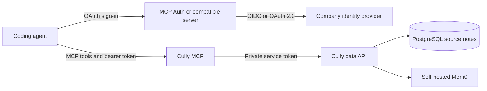

# Deploy Cully for a team

This guide is for the company ops team running Cully for several people. For your own laptop, use the [quickstart](/quickstart). To see how a team uses agent sessions for project work, read [run projects with agents](/team-workflows). In a team deployment, everyone connects to the same public MCP endpoint, signs in through the company's identity provider, and accesses only their own records. The `personal` and `company` sections organize one person's records; they do not make records visible to coworkers.



## Choose how to run the stack

The [Docker Compose setup](/oauth#self-hosted-docker-with-mcp-auth) starts Cully, PostgreSQL, Mem0, MCP Auth and Caddy on one machine. It is the shortest deployment path.

For Kubernetes or another container platform, Cully release tags publish matching `ghcr.io/mcp-runtime/cully-mcp`, `ghcr.io/mcp-runtime/cully-data` and `ghcr.io/mcp-runtime/cully-mem0` images. Use the [Compose file](https://github.com/mcp-runtime/cully/blob/main/deploy/self-hosted/compose.yaml) as the service and volume reference. Run the data image's `migrate` command before serving traffic. Give Mem0 its pgvector-enabled PostgreSQL database and persistent history volume. Keep both databases, Mem0 REST and the data API on private networks; expose only MCP through HTTPS.

| Service | Essential settings |
| --- | --- |
| Cully MCP | `CULLY_DATA_API_URL`, private `CULLY_DATA_API_TOKEN`, `CULLY_MCP_AUTH_MODE=oauth`, exact `CULLY_AUTH_ISSUER`, `CULLY_AUTH_RESOURCE` and `CULLY_JWKS_URL`. |
| Data API | `CULLY_DATABASE_URL`, the same `CULLY_DATA_API_TOKEN`, `CULLY_MEM0_URL` and `CULLY_MEM0_API_KEY`. |
| Mem0 | Its pgvector/PostgreSQL settings, `ADMIN_API_KEY` matching the data API's Mem0 key, `JWT_SECRET` and persistent history volume. |

The [configuration reference](/configuration) has the full variable list and credential boundaries. Agents receive only the public MCP URL and their own OAuth sign-in; service secrets stay with the deployment.

### Quick path with Docker Compose

After installing the Cully CLI, open a new terminal and run `cully setup --prepare` to create editable files. Set the public MCP and authorization hostnames and the upstream identity-provider client secret in `~/.cully/self-hosted/config/.env`. Add the provider's `connectors.json` and a persistent signing key as shown in the [OAuth setup](/oauth#self-hosted-docker-with-mcp-auth). Then start the stack:

```sh
cully setup --oauth
```

This starts PostgreSQL, Mem0, the data API, Cully MCP, MCP Auth and Caddy. Each person then connects their agent to the public MCP URL; the [agent guide](/agents) gives the client commands.

### Example: run Cully with MCP Runtime

The Cully maintainer runs a personal Cully MCP endpoint on [MCP Runtime](https://mcpruntime.org). Its [deployment workflow](https://github.com/mcp-runtime/cully/blob/main/.github/workflows/deploy.yml) builds and publishes the MCP image, then deploys the [server manifest](https://github.com/mcp-runtime/cully/blob/main/.mcp/servers.yaml). Cully's data API, PostgreSQL and Mem0 run separately. The [MCP Runtime publishing guide](https://docs.mcpruntime.org/publish-mcp-server/) shows the build, push and deploy flow.

A company can use this pattern to run Cully's MCP container as an `MCPServer` workload on its Kubernetes cluster. MCP Runtime manages the container rollout, service and workload status; Cully supplies the memory tools and owner-scoped storage. The [MCP Runtime API reference](https://github.com/mcp-runtime/mcp-runtime/blob/main/docs/api.md#mcpserver-surface) lists the workload image, port and secret environment fields. The company ingress publishes Cully's OAuth and MCP routes.

1. Deploy Cully's PostgreSQL, Mem0 and private data API in the cluster. Keep those services on private networking and run `cully-data migrate` before starting the API. Use the [Compose file](https://github.com/mcp-runtime/cully/blob/main/deploy/self-hosted/compose.yaml) to map the service dependencies and volumes.
2. Publish `ghcr.io/mcp-runtime/cully-mcp:<matching-release-tag>` through MCP Runtime as a workload listening on Cully's configured port. Set `CULLY_DATA_API_URL` to the private data API and set `CULLY_MCP_AUTH_MODE=oauth`, `CULLY_AUTH_ISSUER`, `CULLY_AUTH_RESOURCE` and `CULLY_JWKS_URL` as described below. Give `CULLY_DATA_API_TOKEN` through a Kubernetes Secret with the same value used by the private data API. The maintainer's manifest expects `cully-data-api-token` in `mcp-servers` with key `CULLY_DATA_API_TOKEN`; provision it before rollout and keep the value out of Git. Do not set a fixed `CULLY_MCP_OWNER` for a multi-person server.
3. Route a dedicated HTTPS host, for example `https://cully.example.com/mcp`, to the Cully service. Forward its OAuth discovery and MCP paths as well as the `Authorization` header to Cully. Connect the company's identity provider through MCP Auth or a compatible authorization server, then sign in from each person's agent.

Keep MCP Runtime's OAuth gateway **off for this Cully route** in the current integration. Its gateway [strips the client bearer token before forwarding](https://github.com/mcp-runtime/mcp-runtime/blob/main/docs/api.md#security-and-auth), while Cully currently validates that token to identify each memory owner. Use Cully's OAuth mode at the service boundary until an explicit, verified identity handoff is implemented. This example uses MCP Runtime's workload management; it does not claim its grant and session policy for Cully.

After deployment, check that the Cully Deployment's updated and ready replicas match its desired replicas and that its pod runs the new image tag. The CLI can report Ready while an older pod serves traffic during a failed rollout ([Runtime issue #636](https://github.com/mcp-runtime/mcp-runtime/issues/636)).

<div class="related-product">
  <p class="related-product__eyebrow">Another product from the Cully maintainer</p>
  <h3>MCP Runtime</h3>
  <p>An open source Kubernetes platform for deploying and operating MCP servers. The Cully maintainer uses it to publish Cully's MCP workload and route, while Cully keeps its owner-scoped memory and token validation.</p>
  <div class="related-product__links">
    <a href="https://mcpruntime.org">Explore MCP Runtime ↗</a>
    <a href="https://docs.mcpruntime.org/publish-mcp-server/">Read the publishing guide ↗</a>
  </div>
  <p class="related-product__contact">If your team needs a platform for MCP servers, <a href="mailto:princekrroshan01@gmail.com?subject=MCP%20Runtime%20for%20our%20team">contact the maintainer</a>.</p>
</div>

## Connect sign-in

1. Choose the public MCP URL, such as `https://mcp.example.com/mcp`, and an authorization-server URL. The exact MCP URL must be the token's resource audience.
2. Configure [MCP Auth](https://github.com/mcp-runtime/mcp-auth/blob/main/docs/auth-server.md#connect-an-organizations-identity-provider) or a compatible authorization server with the company's identity provider. Grant `tools:read` and `tools:write` for the MCP resource.
3. Configure Cully MCP with `CULLY_MCP_AUTH_MODE=oauth`, the issuer, exact resource URL and JWKS URL. The [configuration reference](/configuration#manual-mcp-service-settings) lists the service variables.
4. Give each person the public MCP URL. They pick their agent and install and connect with:

   <InstallCommand template="curl -fsSL https://cully.net/install.sh | sh -s -- --agent {agent} --mcp-url https://mcp.example.com/mcp --oauth" />

   Then they sign in; for Codex, run `codex mcp login cully`. See [connect an agent](/agents) for its sign-in step.

MCP uses a private service token to call the data API. The data API holds database and Mem0 credentials. Keep those credentials in the deployment's secret store; agents need only the public MCP URL and their own OAuth sign-in. The [architecture](/architecture) shows the service flow.
